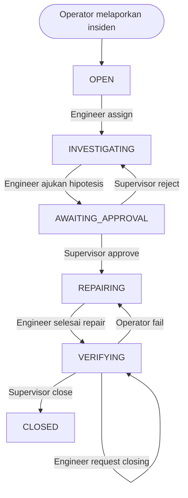

# MiniLog

MiniLog adalah aplikasi **manajemen insiden** berbasis **Laravel 12** dengan **Inertia.js**, **Vue 3**, dan **Tailwind CSS**. Aplikasi ini menangani seluruh alur pelaporan insiden — mulai dari pelaporan, verifikasi, investigasi, perbaikan, review, hingga closing — dilengkapi master data, notifikasi, audit log, dan output PDF, dengan pembagian **role** seperti **operator**, **engineer**, dan **supervisor**.

## 🔗 Uji Coba

Aplikasi dapat diakses langsung melalui: [**http://43.173.30.69:8001/login**](http://43.173.30.69:8001/login)

### Akun Bawaan Seeder

| Role | Nama | Username | Email Login |
|------|------|----------|-------------|
| **Supervisor** | Wahyu Hidayat | `wahyu_sup` | `wahyu_sup@minilog.local` |
| **Engineer** | Agus Wicaksono | `agus_eng` | `agus_eng@minilog.local` |
| **Engineer** | Budi Prasetyo | `budi_eng` | `budi_eng@minilog.local` |
| **Operator** | Joko Susilo | `joko_op` | `joko_op@minilog.local` |
| **Operator** | Siti Aminah | `siti_op` | `siti_op@minilog.local` |

> Password sama untuk semua akun (`12345`). Di-generate otomatis saat `php artisan migrate:fresh --seed`.
>
> 📖 **Panduan penggunaan untuk masing-masing role (Operator, Engineer, Supervisor) bisa dilihat di bagian [Tutorial Penggunaan per Role](#-tutorial-untuk-operator) di bawah.**

## Tech Stack

| Lapisan | Teknologi |
|---------|-----------|
| **Backend** | Laravel 12, PHP 8.3+ |
| **Frontend** | Vue 3, Inertia.js 2, Tailwind CSS 3 |
| **Build Tool** | Vite 7, Laravel Vite Plugin |
| **Database** | MySQL, MariaDB, PostgreSQL, atau SQLite |
| **Autentikasi** | Laravel Breeze, Laravel Sanctum |
| **PDF** | barryvdh/laravel-dompdf |
| **Chart** | Chart.js 4, vue-chartjs 5, chartjs-plugin-datalabels |
| **HTTP Client** | Axios |

## Fitur Utama

### 🔐 Autentikasi & Manajemen Pengguna
- Register, login, logout, reset password, verifikasi email
- Role-based access control: **Operator**, **Engineer**, **Supervisor**
- Manajemen profil pengguna

### 📋 Manajemen Insiden
- **Pelaporan** — Operator melaporkan insiden dengan upload attachment (gambar/dokumen)
- **Verifikasi** — Insiden diverifikasi oleh supervisor
- **Investigasi** — Engineer melakukan investigasi dan repair
- **Review & Closing** — Supervisor mereview hasil investigasi dan menutup insiden
- **Timeline** — Riwayat status insiden yang tercatat
- **Chart** — Visualisasi data insiden per role (dashboard masing-masing role)

### 📂 Master Data
- **Kategori Barang** — Manajemen kategori
- **Barang** — Manajemen barang/aset
- **Departemen** — Manajemen departemen
- **Lokasi** — Manajemen lokasi

### 🔔 Notifikasi
- Pusat notifikasi untuk setiap perubahan status insiden
- Notifikasi real-time untuk role yang relevan

### 📜 Audit Log
- Catatan semua perubahan data insiden
- Dilengkapi dengan detail perubahan (old value → new value)

### 📄 Output PDF
- Ekspor data insiden ke format PDF
- Ekspor laporan audit

### 📎 Lampiran (Attachment)
- Upload gambar dan dokumen pada insiden
- Mendukung preview gambar (lightbox)

## Requirement

- **PHP** 8.2 atau lebih baru
- **Composer** 2
- **Node.js** 18+ atau versi yang kompatibel dengan Vite
- **NPM** atau **Yarn**
- **Database** — MySQL, MariaDB, PostgreSQL, atau SQLite
- **Ekstensi PHP**: BCMath, Ctype, Fileinfo, JSON, Mbstring, OpenSSL, PDO, Tokenizer, XML, GD, Zip

## Instalasi (Lokal)

### 1. Clone repository

```bash
git clone https://github.com/jioooo20/minilog
cd minilog
```

### 2. Install dependency PHP

```bash
composer install
```

### 3. Install dependency JavaScript

```bash
npm install
```

### 4. Siapkan file environment

```bash
# Windows Command Prompt
copy .env.example .env

# Windows PowerShell
Copy-Item .env.example .env

# Linux / macOS
cp .env.example .env
```

### 5. Generate application key

```bash
php artisan key:generate
```

### 6. Atur database di file `.env`

Sesuaikan nilai berikut dengan konfigurasi lokal kamu:

```env
DB_CONNECTION=mysql
DB_HOST=127.0.0.1
DB_PORT=3306
DB_DATABASE=minilog
DB_USERNAME=root
DB_PASSWORD=
```

> **Untuk SQLite**, set:
> ```env
> DB_CONNECTION=sqlite
> DB_DATABASE="C:\path\to\project\database\database.sqlite"
> ```

### 7. Jalankan migrasi beserta seeding

```bash
php artisan migrate:fresh --seed
```

### 8. Setup cepat (alternatif)

```bash
composer run setup
```

## Menjalankan Aplikasi

### Opsi 1. Jalankan manual

Jalankan tiga proses ini di terminal terpisah:

```bash
php artisan serve
```

```bash
npm run dev
```

```bash
php artisan queue:listen --tries=1 --timeout=0
```

### Opsi 2. Jalankan semua sekaligus

Project ini sudah menyiapkan script development yang menjalankan Laravel server, queue listener, dan Vite secara bersamaan:

```bash
composer run dev
```

## Build untuk Production

```bash
npm run build
```

## Alur Workflow Insiden

MiniLog menggunakan **state machine workflow** untuk mengelola siklus hidup insiden. Berikut diagram alurnya:



### Status & Transisi

| Status | Deskripsi | Aksi Selanjutnya |
|--------|-----------|------------------|
| `open` | Insiden baru dilaporkan | Engineer mengambil (assign) |
| `investigating` | Engineer sedang investigasi | Ajukan hipotesis |
| `awaiting_approval` | Hipotesis menunggu review | Supervisor approve / reject |
| `repairing` | Engineer sedang perbaikan | Selesaikan perbaikan |
| `verifying` | Perbaikan selesai. Status ini mencakup beberapa sub-tahap: verifikasi operator (pass/fail), request closing engineer, dan closing supervisor | 1. Operator pass → tunggu request closing → Supervisor close. 2. Operator fail → kembali ke repairing |
| `closed` | Insiden ditutup | - |

## Tutorial Penggunaan per Role

### 👷 Tutorial untuk Operator

Operator bertugas melaporkan insiden dan memverifikasi hasil perbaikan.

#### 1. Melaporkan Insiden Baru

1. Login dengan akun **Operator**
2. Klik menu **Insiden** → **Laporkan Insiden** (atau tombol **+ Tambah**)
3. Isi form insiden:
   - **Judul Insiden** — Nama insiden yang jelas
   - **Barang** — Pilih barang/aset yang mengalami insiden (hanya barang dengan status **operational** yang bisa dipilih)
   - **Komponen** (opsional) — Pilih komponen jika relevan
   - **Lokasi** — Lokasi barang
   - **Severitas** — Pilih level: *Low*, *Medium*, *High*, atau *Critical*
   - **Deskripsi** — Penjelasan detail insiden
   - **Lampiran** (opsional) — Upload gambar atau dokumen pendukung
4. Klik **Simpan**
5. Insiden akan muncul di daftar dengan status **Open**
6. Sistem akan memberi notifikasi ke Engineer

#### 2. Melihat Daftar Insiden

- Buka menu **Insiden** untuk melihat semua insiden yang Anda laporkan
- Gunakan filter **status**, **severitas**, atau **tanggal** untuk mencari
- Klik insiden untuk melihat detail lengkap

#### 3. Verifikasi Hasil Perbaikan

Setelah Engineer menyelesaikan perbaikan, Anda akan mendapat notifikasi:

1. Buka detail insiden yang berstatus **Verifying**
2. Periksa hasil perbaikan (catatan corrective actions, parts replaced, dll.)
3. Klik tombol **Verifikasi**
4. Pilih:
   - **Setuju (Pass)** — Jika perbaikan sudah sesuai
   - **Tolak (Fail)** — Jika perbaikan belum sesuai (insiden akan kembali ke status **Repairing**)
5. Isi catatan verifikasi jika perlu

#### 4. Dashboard Operator

- Buka halaman **Dashboard** untuk melihat chart statistic insiden yang Anda laporkan
- Menampilkan jumlah insiden per status, severitas, dan tren waktu

---

### 🔧 Tutorial untuk Engineer

Engineer bertugas menangani investigasi dan perbaikan insiden.

#### 1. Mengambil Insiden (Assign)

1. Login dengan akun **Engineer**
2. Buka menu **Insiden** — lihat daftar insiden dengan status **Open**
3. Klik insiden yang ingin ditangani
4. Klik tombol **Ambil Alih (Assign)**
5. Status insiden berubah menjadi **Investigating**

#### 2. Investigasi & Mengisi Laporan

1. Pada halaman detail insiden, klik **Investigasi**
2. Isi temuan investigasi:
   - **Catatan Investigasi** — Deskripsi hasil investigasi (bisa disimpan sebagai draft)
   - **Hipotesis Akar Masalah** — Dugaan sementara penyebab insiden
3. Klik **Simpan Draft** untuk menyimpan tanpa mengubah status
4. Jika sudah yakin, klik **Ajukan Hipotesis**
5. Status berubah menjadi **Awaiting Approval**

> 💡 **Draft** bisa disimpan berkali-kali. Gunakan **Ajukan Hipotesis** hanya ketika data sudah lengkap.

#### 3. Supervisor Menyetujui/Menolak Hipotesis

- Jika **disetujui** → Status berubah menjadi **Repairing**, Anda bisa mulai perbaikan
- Jika **ditolak** → Status kembali ke **Investigating**, perbaiki laporan Anda

#### 4. Melakukan Perbaikan

1. Buka halaman investigasi (lihat tombol **Perbaikan**)
2. Isi detail perbaikan:
   - **Tindakan Korektif** — Apa yang dilakukan untuk memperbaiki
   - **Komponen yang Diganti** (opsional) — Sparepart yang diganti
3. Klik **Simpan Draft** untuk menyimpan progres
4. Jika perbaikan selesai, klik **Selesaikan Perbaikan**
5. Status berubah menjadi **Verifying**

#### 5. Request Closing (Setelah Diverifikasi)

Setelah Operator memverifikasi dan menyatakan **Pass**:

1. Buka halaman detail insiden
2. Klik **Request Closing**
3. Supervisor akan menerima notifikasi untuk menutup insiden

#### 6. Dashboard Engineer

- Buka **Dashboard** untuk melihat chart insiden yang ditangani
- Menampilkan jumlah insiden aktif, per status, dan severitas

---

### 👑 Tutorial untuk Supervisor

Supervisor bertugas mengawasi seluruh alur insiden, memverifikasi hipotesis, dan menutup insiden, serta mengelola master data.

#### 1. Review Hipotesis Engineer

1. Login dengan akun **Supervisor**
2. Buka menu **Insiden**
3. Cari insiden dengan status **Awaiting Approval**
4. Klik insiden untuk melihat detail, lalu klik **Review**
5. Periksa:
   - Hasil investigasi Engineer
   - Hipotesis akar masalah
   - Catatan investigasi
6. Ambil keputusan:
   - **Setuju (Approve)** — Hipotesis diterima, Engineer bisa mulai perbaikan
   - **Tolak (Reject)** — Beri catatan penolakan, Engineer harus revisi
7. Status insiden akan berubah sesuai keputusan

#### 2. Menutup Insiden

Setelah Engineer request closing dan Operator sudah verifikasi:

1. Buka menu **Insiden**
2. Cari insiden dengan status **Verifying** yang sudah di-request closing
3. Klik **Tutup Insiden**
4. Isi **Catatan Penutupan**
5. Klik **Tutup**
6. Status insiden berubah menjadi **Closed**
7. Barang yang bermasalah akan dikembalikan ke status **Operational** (jika tidak ada insiden lain yang aktif pada barang yang sama)

#### 3. Mengelola Master Data

1. Buka menu **Master Data**
2. Pilih jenis data yang ingin dikelola:
   - **Kategori** — Tambah/sunting/hapus kategori barang
   - **Barang** — Tambah/sunting/hapus barang/aset
   - **Departemen** — Tambah/sunting/hapus departemen
   - **Lokasi** — Tambah/sunting/hapus lokasi
3. Gunakan tombol **+ Tambah** untuk data baru
4. Klik ikon pensil untuk mengedit, ikon tong sampah untuk menghapus
5. Data yang dihapus bisa dipulihkan melalui tombol **Restore**

> 💡 Data master yang sudah tidak aktif bisa di-soft-delete dan direstore kembali.

#### 4. Melihat Audit Log

1. Buka menu **Audit Log**
2. Pilih insiden untuk melihat riwayat perubahannya
3. Setiap perubahan mencatat:
   - Siapa yang melakukan
   - Aksi apa yang dilakukan
   - Nilai lama dan nilai baru
   - Waktu dan IP address
4. Klik **Export PDF** untuk mengunduh laporan audit
5. Klik **Final Report** untuk mengunduh laporan akhir insiden

#### 5. Dashboard Supervisor

- Buka **Dashboard** untuk melihat overview seluruh insiden
- Menampilkan chart jumlah insiden per status, severitas, dan tren

---
